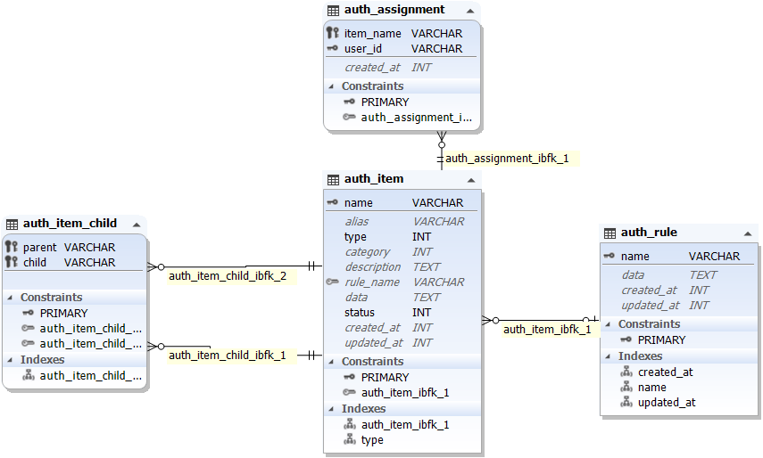

# Symfony-RBAC implementation principle detailed

## First. Introduction

RBAC (Role-Based Access Control) role-based access control.

## Second. the realization of Symfony to rbac

1. Achieve general division into RBAC, and follow the model is also NIST RBAC model.

2. Add auth source: used to extend the access of other business departments or other organizations.

3. Added rule rules for roles (permissions)

## Three. design of table

> ER model




#### 1) Table for storing roles or permissions: auth_item

```sql
CREATE TABLE auth_item (
  name varchar(64) NOT NULL COMMENT'Role (permission) unique identification',
  alias varchar(64) DEFAULT NULL COMMENT'Role (Permission) Name',
  type int(11) NOT NULL COMMENT'type: 1 means role; 2 means permission',
  category int(11) DEFAULT NULL COMMENT'Menu category',
  description text DEFAULT NULL COMMENT'Description',
  rule_name varchar(64) DEFAULT NULL COMMENT'rule rule',
  data text DEFAULT NULL COMMENT'Additional data, serialize to save',
  status int(2) NOT NULL DEFAULT 1 COMMENT'Enable 1 Disable 0',
  created_at int(11) DEFAULT NULL COMMENT'created time',
  updated_at int(11) DEFAULT NULL COMMENT'Update time',
  PRIMARY KEY (name)
)
ENGINE = INNODB,
AVG_ROW_LENGTH = 585,
CHARACTER SET utf8,
COLLATE utf8_general_ci,
COMMENT ='Role Authority Table';

ALTER TABLE auth_item
ADD INDEX type (type);

ALTER TABLE auth_item
ADD CONSTRAINT auth_item_ibfk_1 FOREIGN KEY (rule_name)
REFERENCES auth_rule (name) ON DELETE SET NULL ON UPDATE CASCADE;
```

> 1. `type`: 1 means role, 2 means permission
>
> 2. status: 1 enable, 0 disable
>
> 3. The format of `name` can be customized, so it is extensible, but it needs to be unified and unique.
>
> For example: depending on the controller/method as `name` (**{controller}/{function}** ): user/index


#### 2) The subordinate and subordinate association table of permissions and roles: auth_item_child

> Containment relationship: roles can include roles, roles can include permissions, permissions can include permissions, but permissions cannot include roles

```sql
CREATE TABLE auth_item_child (
  parent varchar(64) NOT NULL COMMENT'Role (Permission) Name',
  child varchar(64) NOT NULL COMMENT'Role (Permission) Name',
  PRIMARY KEY (parent, child)
)
ENGINE = INNODB,
AVG_ROW_LENGTH = 712,
CHARACTER SET utf8,
COLLATE utf8_general_ci,
COMMENT ='Role authority relationship table';

ALTER TABLE auth_item_child
ADD CONSTRAINT auth_item_child_ibfk_1 FOREIGN KEY (parent)
REFERENCES auth_item (name) ON DELETE CASCADE ON UPDATE CASCADE;

ALTER TABLE auth_item_child
ADD CONSTRAINT auth_item_child_ibfk_2 FOREIGN KEY (child)
REFERENCES auth_item (name) ON DELETE CASCADE ON UPDATE CASCADE;
```


#### 3) Assignment table of users and permissions (roles): auth_assignment

```sql
CREATE TABLE auth_assignment (
  item_name varchar(64) NOT NULL COMMENT'Role (Permission) Name',
  user_id varchar(64) NOT NULL COMMENT'user id',
  created_at int(11) DEFAULT NULL COMMENT'created time',
  PRIMARY KEY (item_name, user_id)
)
ENGINE = INNODB,
AVG_ROW_LENGTH = 8192,
CHARACTER SET utf8,
COLLATE utf8_general_ci,
COMMENT ='User and role permission relationship table';

ALTER TABLE auth_assignment
ADD CONSTRAINT auth_assignment_ibfk_1 FOREIGN KEY (item_name)
REFERENCES auth_item (name) ON DELETE CASCADE ON UPDATE CASCADE;
```


#### 4) Rule table: auth_rule

```sql
CREATE TABLE auth_rule (
  name varchar(64) NOT NULL COMMENT'Rule name',
  data text DEFAULT NULL COMMENT'stored is a serialized object instance of a class that implements the rbacRule interface',
  created_at int(11) DEFAULT NULL COMMENT'created time',
  updated_at int(11) DEFAULT NULL COMMENT'Update time',
  PRIMARY KEY (name)
)
ENGINE = INNODB,
AVG_ROW_LENGTH = 16384,
CHARACTER SET utf8,
COLLATE utf8_general_ci,
COMMENT ='Permission Rules Table';

ALTER TABLE auth_rule
ADD INDEX created_at (created_at);

ALTER TABLE auth_rule
ADD INDEX name (name);

ALTER TABLE auth_rule
ADD INDEX updated_at (updated_at);
```


## Fourth, user permission check process (pseudo code)

>Scenario use case:
>
>For personal data, we have administrators and employees, allowing administrators to perform any operation on any employee’s personal data, but only allow employees to modify their own personal data, which means that employees have the authority to modify their personal data, but The restriction of Ejia is that you can only modify your own personal information. The verification of Ejia is what the rule is responsible for.

#### 1) Define the generation rules of the permission `name`

> Customizable design

​ Example: You can use the controller access method: controller/method as `name` (**{controller}/{function}** ): user/update

#### 2) Call user check method

​ *Call the can() method in the front method before calling the controller*

```php
$user->can($permissionName, $params = []);
```

> $permissionName: permission user/update
>
> $params = []: business data

```php
//Check if the user has permission for this operation
public function can($permissionName, $params = [])
{
    $access = checkAccess($this->loginUserId, $permissionName, $params);
    
    return $access;
}

//Check to get permission data before
public function checkAccess($userId,$permissionName, $params = [])
{
    //getAssignments The work of this method is to go to the user and permission (role) assignment table: auth_assignment to find out all the permissions and roles of the user, the specific implementation is as follows:
    $assignments = $this->getAssignments($userId);
    
    //A series of checks whether the permission is hit
    $res = $this->checkAccessRecursive($userId, $permissionName, $params, $assignments)
    
    return $res;
}


//Key method: Decide whether recursively hits permissions
protected function checkAccessRecursive($user, $itemName, $params, $assignments)
{
//Find the user/update record of this permission from the table of storing roles or permissions: auth_item and encapsulate it into an object for use in the executeRule method
    if (($item = $this->getItem($itemName)) === null) {
        return false;
    }
 
    //Find the rule corresponding to the permission (user/update) in the rule table: auth_rule through $item->ruleName, and if there is one, perform the rule verification of the permission operation for the user, if the verification fails, return false directly
    if (!$this->executeRule($user, $item, $params)) {
        return false;
    }
 
//If the permission is matched in the allocation table of user and permission (role) and the rule verification is OK, it means that the user has permission.
    if (isset($assignments[$itemName]) || in_array($itemName, $this->defaultRoles)) {
        return true;
    }
 
//If it is currently seen that the user does not have the permission for this operation, then find the parent of the permission from the upper and lower levels of permissions and roles, and then recursively check whether the user has permission in the parent, if the parent If you have permission, then you have the permission (pseudo sql)
    $parents = (new Query)
        ->select(['parent'])
        ->from('auth_item_child')
        ->where(['child' => $itemName])
        ->asArray();

    foreach ($parents as $parent) {
        if ($this->checkAccessRecursive($user, $parent, $params, $assignments)) {
            return true;
        }
    }
 
    return false;
}

//Execute rules
protected function executeRule($user, $item, $params)
{
    if ($item->ruleName === null) {
        return true;
    }
    
    //Go to the rule table according to the rule_name corresponding to the item permission record: find the rule record in auth_rule
    //And deserialize the data field (previously said that it is a serialized object) to get the object of the rbac\Rule implementation class
    $rule = $this->getRule($item->ruleName);
    if ($rule instanceof Rule) {
        //Execute the execute method of the object to verify whether the user has the right to use the permission
        return $rule->execute($user, $item, $params);
    } else {
        throw new Exception("Rule not found: {$item->ruleName}");
    }
}
```

> The parent level is that the permissions and roles are becoming more and more rigorous. If the maximum level of a user’s permissions cannot be found, look for the stricter the parent level, if not

#### 3) Implementation of rule verification method (pseudo code)

> Implement the execute method in the abstract class Rule

```php
<?php
abstract class Rule
{
    public $name;

    public $createdAt;

    public $updatedAt;
    
    abstract public function execute($user, $item, $params);
}

```


```php
<?php
/**
 * Check whether the user_id of the personal center is the same as the id of the user
 */
 class UserUpdateRule extends Rule {
    public function execute($user, $item, $params)
    {
        //Find the user_id of the data
        $userInfo = UserInfo::findOne(['user_id'=>$params['user_id']]);
        return $userInfo && $userInfo->user_id == $user? true: false;
    }
}
```
